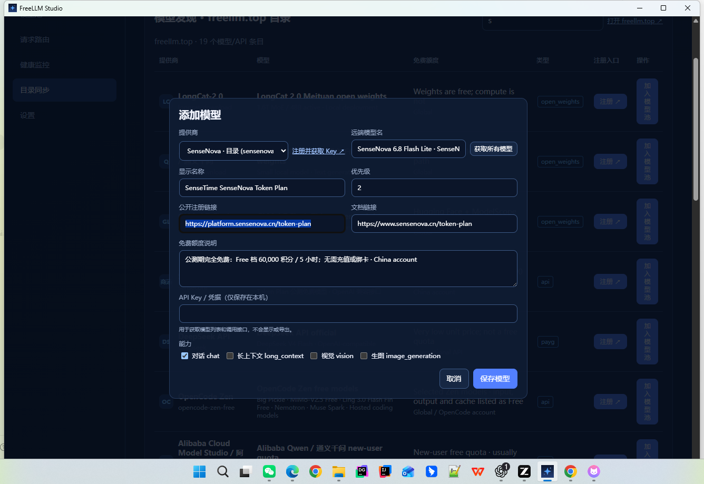

# FreeLLM Gateway · AI Base (Phase 1)

本地运行的多 Provider 模型网关，提供 OpenAI 兼容接口和 FreeLLM Studio 桌面控制台。

> **Phase 1 平台骨架**：在原有模型路由之上，增加默认租户 / 应用凭证、调用审计证据链、用量统计，以及管理台「应用接入 / 审计日志 / 用量统计」页面，向「AI 底座」演进。



## 功能

- OpenAI 兼容：`/v1/chat/completions`、`/v1/embeddings`、`/v1/images/generations` 等
- 多 Provider 路由、健康检查、失败转移
- 从 `freellm.top` 目录自动带出 Provider、注册地址、文档和免费额度说明
- API Key 仅保存在本机凭据存储，不写入目录导出或接口响应
- Windows 桌面版启动时自动运行本地网关，不弹出 CMD 窗口
- **应用接入**：创建 App、生成/撤销 Credential（密钥仅显示一次）
- **审计日志**：每次 `/v1/*` 调用写入 requestId、模型、延迟、Token、错误类型
- **用量统计**：近 N 天调用量、成功率、Token、按模型聚合
- 统一 Header：`X-Request-ID`、`X-Tenant-ID`、`X-App-ID`（可选）
- **知识库（Phase 2）**：文档入库、分块、BM25 / Hybrid RAG 检索（本地 hashing embedding + 融合）
- **多模型执行（Phase 3）**：Model Group + Execution Policy，支持 `single` / `fallback` / `parallel`，一次请求可保留多个模型的独立答案

## 桌面版

见 `desktop/` 与发布说明。

## 快速开始

```bash
pip install -e .
freellm-gateway serve
# 管理台 http://127.0.0.1:8787/admin
```

## AI 底座演进路线

| 阶段 | 内容 |
|------|------|
| Phase 1 | 租户/应用/凭证、审计、用量、管理台骨架 |
| Phase 2 | 知识库 ingest + BM25 + Hybrid RAG（本地 embedding） |
| Phase 3 | Model Group、Execution Policy、Model Run；single / fallback / parallel 多模型执行 |
| 后续 | consensus / review / pipeline、Evaluator、Prompt/Workflow 编排、更完整 IAM/RBAC |

## 开发

```bash
pytest
```

请将敏感配置放在 `.env` 或系统环境变量，不要提交 API Key、数据库、日志和构建缓存。


## 多模型执行（Phase 3）

先创建执行策略与模型组，然后调用模型组接口。同一个 Group 中的成员是现有 `route_id`，因此 Provider 与编排层保持解耦。

```text
POST /api/admin/execution-policies
POST /api/admin/model-groups
POST /v1/model-groups/{group_id}/chat/completions
GET  /api/admin/model-runs
```

`parallel` 会保留每个模型的独立响应；部分模型失败时 Run 状态为 `partial`，不会丢弃已成功的答案。
