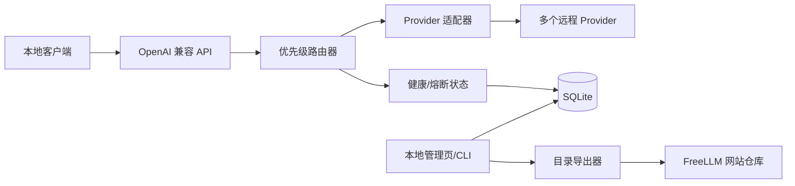

# FreeLLM Gateway 设计说明

## 目标

构建一个 Windows 本地运行、无需 Docker 的个人模型网关，统一管理多个 Provider/API Key/远程模型，并通过 OpenAI 兼容接口调用。网关按管理员配置的优先级选择模型，在失败、超时、限流或额度耗尽时自动切换；同时生成脱敏的公开目录数据，供独立的 FreeLLM 网站仓库刷新模型列表和注册入口。

## 约束与边界

- 独立 Git 项目：`D:\WorkSpace\freellm-gateway`。
- 默认只监听 `127.0.0.1`，个人使用，不做多租户、计费或公网 SaaS。
- API Key 只保存在本机安全存储或加密数据库中，绝不进入目录导出文件。
- 只接入用户有权使用的 Provider 和模型；不通过轮换账号规避平台限制。
- 网站仓库 `D:\WorkSpace\freellm` 仍以 `data/offers.json` 为公开目录源文件，网关通过版本化导出格式对接。

## 架构

采用模块化单体：FastAPI HTTP 层、SQLite 配置库、路由与健康状态模块、Provider 适配器、目录同步模块和 CLI 共用一个进程/代码库。

## 核心模型

- `Provider`：名称、协议类型、默认 endpoint、官方地址。
- `Credential`：Provider 关联的密钥引用；秘密值不通过 API 返回。
- `ModelRoute`：Provider、远程模型 ID、显示名、能力、优先级、启用状态、阈值和目录发布状态。
- `HealthState`：健康状态、连续失败数、熔断截止时间、最近延迟、最近探测时间。
- `ProbeResult`：探测耗时、首 Token 延迟、HTTP 状态、错误分类和时间。
- `CatalogEntry`：仅含公开 Provider/模型/能力/注册地址/文档/免费说明/核验时间的脱敏记录。

## 路由行为

- `model=auto`：按优先级升序遍历候选模型。
- 指定模型：只调用匹配的启用路由，不自动改成其他模型。
- 过滤条件：能力不匹配、手动禁用、处于熔断冷却期、超过延迟阈值或额度耗尽的路由跳过。
- 失败分类：网络超时、HTTP 429、5xx、认证失败、额度耗尽、请求参数不支持分别记录。
- 429/额度耗尽：标记为 `rate_limited`/`quota_exhausted`，进入冷却期，自动尝试恢复探测。
- 连续失败达到阈值：进入 `cooldown`；冷却结束后半开放探测，成功则恢复 `healthy`。
- 速度判定使用每个路由自己的首 Token/总耗时阈值和最近窗口，避免单次抖动导致永久跳过。
- 流式响应仅在尚未发送首个 Token 前允许切换；已经输出部分内容后返回当前结果及错误信息，不重复调用备用模型。

## 对外接口

- `GET /health`：网关进程健康检查。
- `GET /v1/models`：返回可用公开模型及 `auto`，不暴露密钥和内部 endpoint 凭据。
- `POST /v1/chat/completions`：接受 OpenAI Chat Completions 请求，支持 `auto` 和具体远程模型别名。
- `GET/POST/PATCH/DELETE /api/admin/providers`：本地管理 Provider。
- `GET/POST/PATCH/DELETE /api/admin/routes`：管理模型、优先级和策略。
- `POST /api/admin/routes/{id}/probe`：手动探测。
- `POST /api/admin/catalog/export`：生成网站仓库可消费的脱敏导出并返回变更摘要。

管理接口要求本地管理令牌；默认从环境变量或首次启动生成，API 调用令牌与管理令牌分离。

## 网站同步

网关生成 `catalog-export.json`，包含 `schemaVersion`、生成时间和公开模型记录。网站侧同步命令读取该文件，把“已批准 Provider + 已确认模型”转换为现有 `data/offers.json` 记录；新增但未确认的模型进入网站仓库的 `data/review-queue.json`。同步后执行现有 `build_static.py` 和 `build_seo_pages.py`，先检查 diff，再由用户提交/推送。

本地观测的延迟和账号配额不直接作为公共事实；网页只显示“本地探测状态”或核验日期，并保留官方注册链接。

## 技术选型

- Python 3.11+
- FastAPI + Uvicorn
- httpx（异步 HTTP 与测试传输）
- SQLite（标准库 sqlite3，减少部署依赖）
- cryptography/keyring（本机密钥保护）
- pytest + pytest-asyncio
- 简单静态管理页，不引入独立前端构建链

## 验收标准

1. 可添加至少两个 Provider 和多个模型路由。
2. 可调整模型顺序，`auto` 严格按顺序尝试。
3. 失败、超时、429、额度耗尽模型会被跳过并记录原因。
4. 冷却后模型可自动恢复，不需要重启程序。
5. OpenAI 兼容客户端可以调用非流式和流式请求。
6. 密钥不会出现在响应、日志或目录导出中。
7. 可生成网站目录导出，新增模型可进入草稿队列，已批准模型可刷新网站页面。
8. 主要路由、熔断、同步和安全行为有自动化测试。

## 暂不实现

- 多用户登录、团队权限、计费和公网部署。
- 自动轮换账号、代理池或绕过 Provider 限流。
- 完整对话内容持久化。
- 复杂的分布式队列和微服务拆分。
