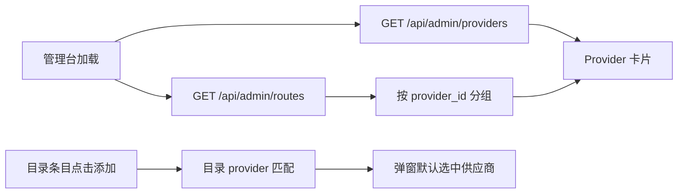

# Provider 模型列表设计

## 目标

在网关管理台的设置页中，以供应商为主卡片展示已配置模型：供应商名称和基础信息直接显示；同一供应商下的多个模型各占一行，避免被合并成一段文本。添加模型弹窗从目录条目进入时，自动选择该条目对应的供应商。

## 范围与约束

- 只修改 `freellm-gateway` 管理台及其测试，不修改旁边的 `freellm` 网站仓库。
- 保留现有模型池页面的逐路由表格、优先级、健康状态和操作按钮。
- 复用现有 `/api/admin/routes` 与 `/api/admin/providers` 数据，不新增数据库字段；供应商卡片在前端按 `provider_id` 将路由分组。
- 供应商没有模型时仍显示供应商卡片和空状态；模型信息使用显示名称、远端模型名、能力标签和启用/健康状态。
- 从目录添加模型时优先匹配已配置供应商；否则使用目录中同名的临时供应商选项，并在保存时沿用现有 Provider 创建流程。

## 交互设计

设置页的 Provider Directory 每个供应商显示名称、ID、协议、Base URL 和“发现模型”按钮。卡片下方显示“模型列表”，每个模型独立一行；同一个远端模型由不同供应商提供时，分别出现在各自供应商卡片中。模型列表为空时显示“暂无已配置模型”。

目录页的“添加到模型池”入口继续把目录条目的 provider 带入添加模型弹窗；弹窗在有明确目录匹配时默认选中该 Provider。普通“添加模型”仍使用已配置 Provider 或目录 Provider 选项，不改变手动选择能力。

## 数据流与错误处理

接口失败沿用现有管理台错误提示和刷新逻辑；缺失 Provider 的旧路由仍回退显示 `provider_id`，不能阻塞模型池或设置页渲染。

## 验收标准

1. Provider 卡片直接显示供应商名称、ID、协议和 Base URL。
2. 一个供应商关联多个路由时，模型列表显示多行，每行至少包含模型名称和远端模型名。
3. 一个远端模型被多个供应商提供时，不做全局去重，各供应商卡片分别显示。
4. 无模型的供应商显示空状态，不报错。
5. 从目录条目添加模型时，弹窗默认选中对应供应商；已有供应商优先于目录临时供应商。
6. 现有管理台认证、模型池、目录和完整测试不回归。
