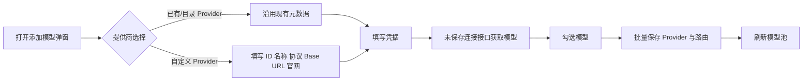

# 添加模型弹窗自定义 Provider 设计

## 目标

在模型池的“添加模型”弹窗内直接创建并使用自定义 Provider，不要求用户先离开弹窗到“设置”页保存 Provider。自定义 Provider 与目录/已保存 Provider 使用相同的协议适配、模型发现、凭据保存和模型路由流程。

## 范围与约束

- 只扩展管理台添加模型流程及其测试，不改变外部 OpenAI 兼容接口。
- 支持现有的 `openai`、`anthropic`、`gemini` 三种协议。
- 自定义 Provider 的必填字段为 Provider ID、名称、协议、Base URL、官网/公开链接；官网/公开链接沿用现有 Provider 的 HTTPS 校验规则。
- Base URL 沿用现有规则：公网连接必须使用 HTTPS，本机 sidecar 可使用 loopback HTTP；URL 不得包含用户名或密码。
- API Key 只在当前表单和本地 SecretStore 流转，不回显、不写入前端持久化数据、不进入响应或目录导出。
- 编辑已有模型路由时保持现有流程，不展示或覆盖自定义 Provider 创建字段。

## 方案

提供商下拉框新增“自定义 Provider…”选项。选择该选项后，在下拉框下方显示自定义 Provider 字段；切换回已有 Provider 或目录 Provider 时隐藏这些字段，并恢复现有元数据自动填充行为。

模型发现优先调用已有的 `POST /api/admin/connection/models`，把表单构造的临时 Provider 和凭据提交给后端。发现阶段不写数据库、不保存凭据。保存阶段继续使用 `POST /api/admin/routes/bulk` 或 `POST /api/admin/routes`，由后端完成 Provider upsert、凭据保存和路由创建。这样自定义 Provider 与“多连接添加”的未保存连接安全边界一致，并避免在用户点击“获取所有模型”时留下空 Provider。

## 交互与数据流



自定义 Provider 的单模型手工输入和多模型导入都支持。获取模型成功后，返回模型列表进入现有批量勾选面板；没有获取模型时仍允许直接填写一个模型名并走单模型保存。切换 Provider 时清空发现结果，避免把前一个 Provider 的模型提交到新连接。

## 前端接口设计

新增表单内部接口函数：

```text
customProviderFromForm(form) -> ProviderPayload
selectedProvider() -> ProviderPayload | null
syncCustomProviderFields() -> void
```

`ProviderPayload` 包含 `id`、`name`、`protocol`、`base_url`、`official_url` 五个字符串字段。已有 Provider 仍从状态和目录候选生成；自定义 Provider 从表单实时生成，不写入 `state.providers`，直到保存成功后由刷新流程加载。

## 后端接口

不新增 endpoint，复用并保持以下契约：

- `POST /api/admin/connection/models`：接受临时 Provider 与 credential，只验证连接并返回模型列表。
- `POST /api/admin/providers`：保存单个自定义 Provider，保留现有字段和 URL 校验。
- `POST /api/admin/routes`：保存单个手工模型路由。
- `POST /api/admin/routes/bulk`：保存自定义 Provider 的多个模型路由，并按 Provider ID 与远端模型名幂等跳过重复路由。

## 错误处理

- 自定义字段不完整：阻止获取/保存，并显示字段级浏览器校验或现有管理台错误提示。
- Base URL、协议或官网/公开链接不合法：由后端返回 422，前端显示错误且不保存 Provider。
- 模型发现失败：只提示当前弹窗错误，保留用户输入的自定义字段和凭据。
- 保存失败：不清空未提交表单；已有成功创建的路由按现有批量接口语义保留。
- 任何错误提示都不得包含 API Key 或 SecretStore 引用。

## 测试与验收

1. 管理台 HTML 暴露自定义 Provider 选项、字段和对应同步函数。
2. 选择自定义 Provider 时显示字段，切换到已有 Provider 时隐藏字段。
3. 自定义 Provider 发现模型请求使用 `/api/admin/connection/models`，而不是已保存 Provider 的模型接口。
4. 自定义 Provider 保存后可创建 Provider 和单个/多个模型路由。
5. 不合法的自定义 Provider 仍被现有后端校验拒绝。
6. API Key、`credential_ref` 和 SecretStore 引用不出现在管理台 HTML 或 API 响应中。
7. 现有管理台、Provider 发现、批量导入、路由和适配器测试全部通过。

## 不在本次范围

- 新增协议适配器。
- 修改数据库表结构或 Provider 数据模型。
- 为自定义 Provider 增加独立的编辑/删除 Provider 操作。
- 在模型路由上保存与 Provider 不同的临时 Base URL。
