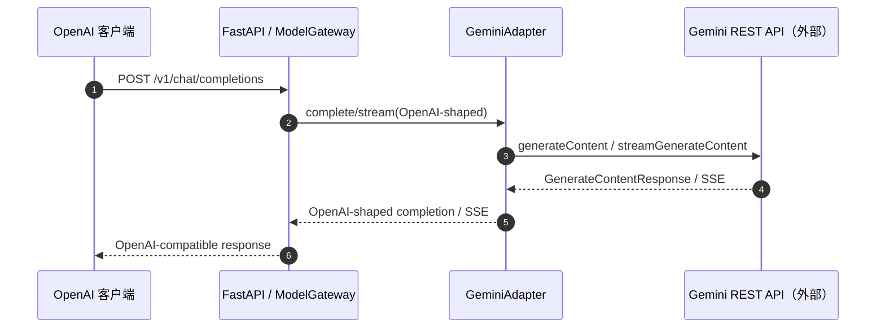

# Gemini 原生 Provider 接入设计

## 目标

在不改变 FreeLLM Gateway 对外 OpenAI 兼容接口的前提下，新增 Google Gemini 原生 REST Provider。用户继续通过管理台填写 Gemini API Key、发现模型、保存路由；网关内部负责把 OpenAI-shaped 请求转换为 Gemini GenerateContent 请求，并把响应转换回 OpenAI-shaped completion/SSE。

## 范围与边界

- 新增协议值 `gemini`，默认 Base URL 为 `https://generativelanguage.googleapis.com/v1beta`。
- 支持文本对话、system instruction、temperature、top_p、max_tokens、stop，以及 data URL 图片输入。
- 支持非流式 `generateContent`、流式 `streamGenerateContent?alt=sse` 和 `GET /models` 模型发现。
- Gemini API Key 仅通过 `x-goog-api-key` 请求头发送，不放入 URL、日志、目录导出或响应。
- 继续使用现有 `ProviderError`、健康探测、失败切换、keyring 凭据存储和 OpenAI 兼容公共 API。
- 不实现 Gemini 原生工具调用、文件上传、音视频、图像生成或 Interactions API；这些能力不属于本次最小接入。
- `gemini-2.0-flash` 可以作为路由字符串保存，但由于 Google 已关停该模型，真实探测会按上游错误显示失败；验收测试使用 `gemini-3.8-flash` 作为示例模型名。

## 接口设计

### `GeminiAdapter`

```python
class GeminiAdapter:
    def __init__(self, base_url: str, api_key: str, client: httpx.AsyncClient | None = None): ...
    async def complete(self, payload: dict) -> dict: ...
    async def stream(self, payload: dict) -> AsyncIterator[bytes]: ...
    async def list_models(self) -> list[str]: ...
    async def aclose(self) -> None: ...
```

- `payload` 是现有网关接收的 OpenAI-shaped 字典，`model` 使用远端 Gemini 模型名。
- `complete` 返回带 `choices[0].message.content` 和标准化 usage 的 OpenAI-shaped 字典。
- `stream` 返回 `data: {...}\n\n` 格式的 OpenAI SSE 字节块，并以 `data: [DONE]\n\n` 结束。
- malformed JSON、缺失候选内容等协议错误统一转换为不可重试的 `ProviderError("provider_protocol_error", 502, ...)`。

## 数据流



## 错误与安全

- 网络超时、HTTP 网络错误、上游错误沿用现有失败分类和重试属性。
- Gemini 401/403 进入 authentication_error，由现有网关停用对应路由。
- API Key 使用专用 header；测试明确断言 URL 不带 `key` 查询参数。
- 官方 Provider URL 必须是 HTTPS，沿用现有管理 API 校验。

## 测试验收标准

- Adapter 非流式请求正确构造 Gemini URL、header、contents、systemInstruction 和 generationConfig，并转换响应与 usage。
- Adapter 流式请求正确解析 SSE、输出 OpenAI chunks、finish reason 和 `[DONE]`。
- 模型发现只返回支持 `generateContent` 的 `baseModelId`，去掉 `models/` 前缀。
- runtime 能从持久化 `protocol=gemini` Provider 构造 adapter。
- 管理 API 接受 `gemini`，模型发现和未保存连接验证都使用 Gemini adapter；未知协议仍返回 422。
- 管理台协议下拉出现 Gemini，既有 OpenAI/Anthropic 测试保持通过。
